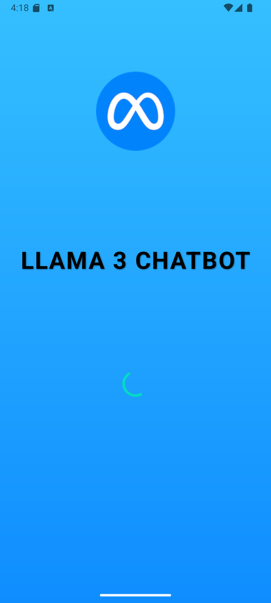
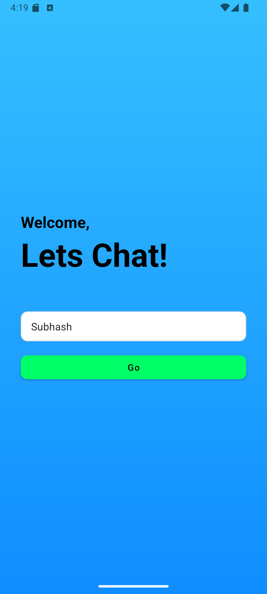
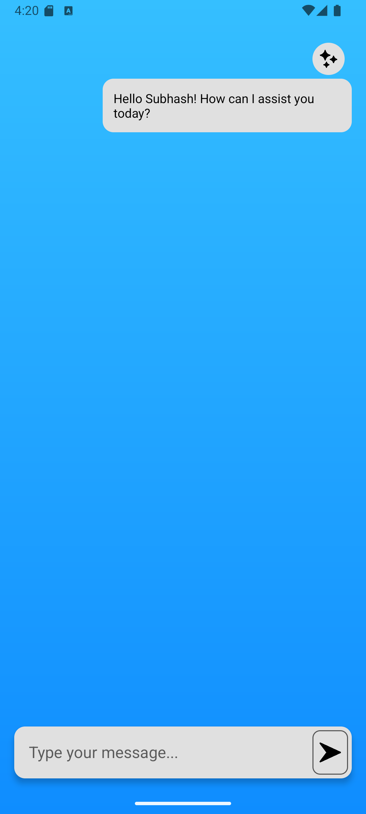
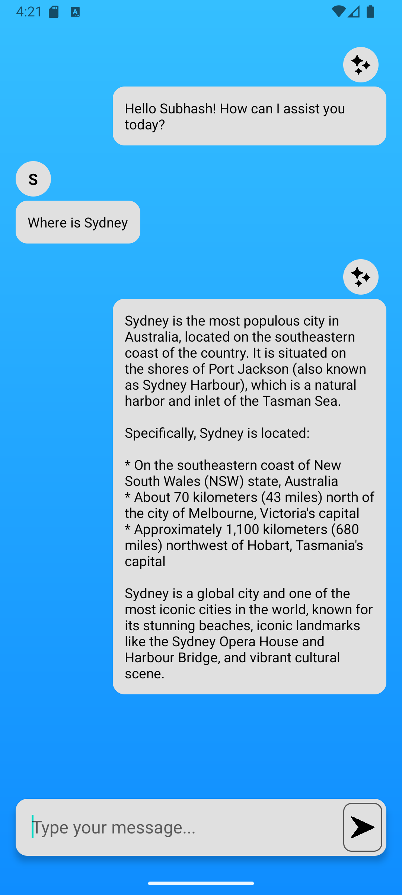

# Llama 3 Chatbot - Android Application  

## Overview  
An Android chat application that connects to a Llama 3 AI backend, featuring a splash screen, user login, and interactive chat interface.  

## Screenshots  

  
      
      
      
      

  

## Features  
- Splash screen with app branding  
- Username-based login  
- Real-time chat with Llama 3 AI  
- Distinct UI for user and bot messages  
- Auto-scroll to latest messages  
- Network error handling  
